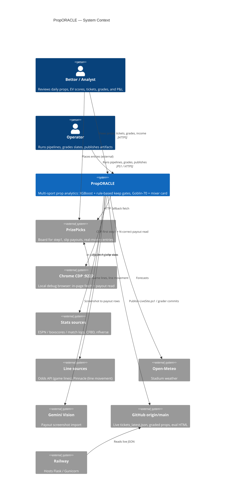
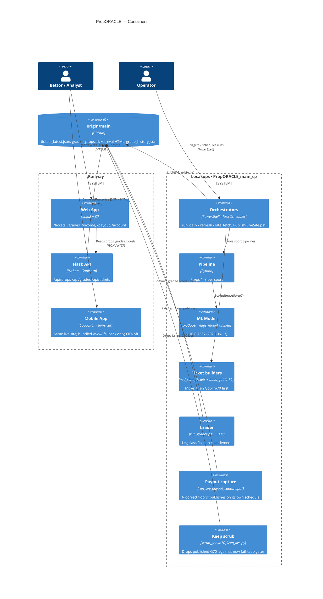
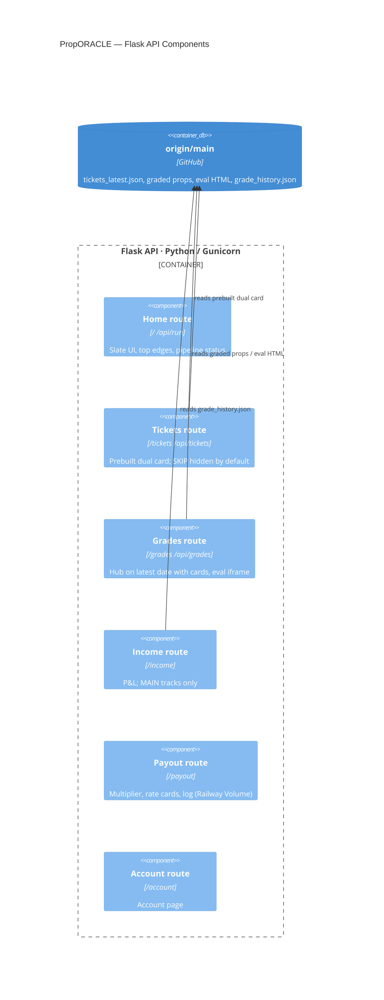

# PropORACLE — Architecture & User Interactions

> **Diagrams in this doc** render natively in GitHub, GitLab, and Cursor's Markdown preview (Mermaid). For full UML notation (ovals, stick figures, `<<include>>`), open the `.puml` files in `docs/diagrams/` with the PlantUML extension or paste into [plantuml.com](https://www.plantuml.com/plantuml). All eight `.puml` files pass `plantuml -checkonly`.

---

## Table of contents

1. [C4 Level 1 — System context](#c4-level-1--system-context)
2. [C4 Level 2 — Containers](#c4-level-2--containers)
3. [C4 Level 3 — Flask API components](#c4-level-3--flask-api-components)
4. [Use case summary](#use-case-summary)
5. [Process flows](#process-flows)
6. [Sport pipeline coverage](#sport-pipeline-coverage)
7. [Open items](#open-items)
8. [Related files](#related-files)

---

## C4 Level 1 — System context



---

## C4 Level 2 — Containers



---

## C4 Level 3 — Flask API components



`/income` is canonical. `/dashboard/income` and `/income.html` return 302 to `/income`.

---

## Use case summary

### Actors

| Actor | Type | Description |
|---|---|---|
| Bettor / Analyst | Person | Browses slate, tickets, grades, income, payout tools, account; mobile via the same live site |
| Operator | Person | Runs pipelines, refreshes, grades, captures payouts, publishes; also browses as Bettor |
| Task Scheduler | System actor | Runs `run_daily.ps1`, refresh / late_fetch, `run_live_payout_capture.ps1`, `run_g70_keep_scrub.ps1`, and the 3AM grader |
| PrizePicks | External | Real-money entries happen here; PropORACLE only supports research and ticket building |

### Use case packages

| Package | Use cases |
|---|---|
| **Slate & research** | View home slate, browse by sport, hot players / consistency, model performance, export Excel |
| **Tickets** | Goblin-70 + mixer (latest), by date, EV & win-rate summaries (MAIN only; YOLO excluded), ticket backtest |
| **Grades & evaluation** | Grades hub, browse graded props, slate eval report, ticket eval report |
| **Income & tracking** | `/income` P&L dashboard, grade history & sport breakdown |
| **Payout tools** | Estimate multiplier, rate cards & combo table, log observation, payout ladder, export logs |
| **Mobile app** | Live site in Capacitor shell via `server.url` (canonical). Bundled `www/` is offline fallback only. OTA off. |
| **Account & UI** | Manage account, toggle theme |
| **Pipeline & ops** | Pipeline status, run step from UI (local only, verify), daily run, refresh / late fetch, sport pipeline, build mixer, build Goblin-70, capture payouts, keep scrub, grade slate, publish, verify deploy |

### Key relationships

```
Run daily pipeline      ──includes──►  Run sport pipeline
Refresh / late fetch    ──includes──►  Run sport pipeline
Run sport pipeline      ──includes──►  Fetch PrizePicks slate
Run sport pipeline      ──includes──►  Enrich & rank props
Run daily / Refresh     ──includes──►  Build combined tickets (mixer)
Build combined tickets  ──includes──►  Build Goblin-70 card (--write-web)
Build Goblin-70 card    ──includes──►  Publish to origin/main
Capture live payouts    ──includes──►  Publish to origin/main      (own schedule)
Scrub G70 legs          ──extends───►  Capture live payouts        (leg dropped → re-price)
Grade completed slate   ──includes──►  Publish (git commit)
Run pipeline step (UI)  ──includes──►  Monitor pipeline job
Bundled offline UI      ──extends───►  Live site in app shell      (offline only)
```

---

## Process flows

| Flow | Diagram | Key facts |
|---|---|---|
| Fetch | `fetch-pipeline.puml` | `refresh.lock` (4h TTL). CDP-first when `:9222` is warm, HTTP fallback, fail-fast skip when both fail (no downstream run on missing step1). NFL `pick_type` on-disk validation. |
| Ticket design | `ticket-design.puml` | Mixer construction (MLB ban, same-player, diversity) -> G70 build -> assemble dual card -> **slate exposure trim** (one ledger, G70 first so G70 wins ties) -> tickets_latest -> publish. Keep files can replace the generic L5=5 + L10>=8 + D + cover stack. YOLO excluded from WR / Income. |
| Grading | `grading.puml` | `combined_ticket_grader.py` **classifies legs**. `build_ticket_eval.py` **settles**: VOID leg dropped, slip pays the smaller-leg N-correct multiplier, <2 playable = refund. MAIN Income tracks: `graded_main`, `high_prob_std_gob` (since Sep 19). |
| Payout scrape | `payout-scrape.puml` | Scheduled publisher. N-correct only, never 1st place. First scrape of slate D is 9PM `-Force`; later windows re-scrape missing / moved slips. |

---

## Sport pipeline coverage

| Sport | AUC (2026-05-25) | Step8 join rate | Gate model | Notes |
|---|---|---|---|---|
| MLB | 0.7268 | ~99.1% | `mlb_keep_gates.py` | Pitcher Goblins L10-primary; MLB Standard hard-banned on G70 |
| NBA | 0.6175 | — | Generic L5/L10/D | `proj_edge` shadow rank for Goblin OVER |
| NBA1H | 0.4511 | — | — | ⚠ Below random on May slice — suppress or investigate |
| NBA1Q | — | — | Generic L5/L10/D | Period-scoped L5 reliability unverified |
| NHL | 0.6905 | ~38% | Generic L5/L10/D | ⚠ Low join rate; SOG / SOT zero-actual grading excluded |
| Soccer | 0.7478 | — | `soccer_keep_gates.py` | World Cup thin-history gate; Passes / Clearances fill failure excluded |
| WNBA | 0.6954 | — | Generic + `ticket_70_pool.py` | CDP-first |
| Tennis | 0.6624 | ~4% | `tennis_keep_gates.py` | Step1 `--cdp` / `--fail-fast`; excluded from Jun-13 retrain |
| NFL | — | — | `nfl_keep_gates.py` | Standard UNDER book live; Goblin tickets off (`NFL_GOBLIN_TICKETS_ENABLED=False`) pending Week 3 |
| CFB | — | — | `cfb_keep_gates.py` | 5 keep-gate fixes; game-script / line composites observe-only |
| CBB | — | — | Generic L5/L10/D | Deactivated from parallel jobs |
| Golf | — | — | Generic L5/L10/D | — |

**Overall model AUC:** see [CURRENT_STATE.md](../CURRENT_STATE.md) (production artifact may differ from May-25 holdout numbers above).

**Fetch note (2026-07-20):** summer boards prefer **CDP-first** via `utils/prizepicks_cdp.py` when Chrome debug is warm; HTTP-only stacks hang on DataDome. Ops cadence: [guides/DAILY_OPS_OVERVIEW.md](../guides/DAILY_OPS_OVERVIEW.md).

---

## Open items

| Item | Where | Status |
|---|---|---|
| `run_daily.ps1` STEP D-G70 calls py directly, not `Invoke-G70WriteWebStandalone` | ticket-design | Known gap |
| Ticket resolver prefers xlsx over a nonempty JSON (Sep 19–23 class) | grading | Harden pending |
| Payout re-scrape after keep scrub | payout-scrape | **N/A for current scrub** -- scrub drops whole tickets (no shrink); survivors keep live_cdp. Real risk is scrub/capture lock race (below). |
| CDP-down payout display source | payout-scrape | Verify |
| Keep scrub publish path | ticket-design | **Confirmed** -- default `run_g70_keep_scrub.ps1` passes `--write --publish-live`; Publish-LiveSite on drops. Opt out: `-SkipPublish`. |
| Scrub vs capture write race | ticket-design / payout-scrape | **Known gap** -- scrub does not take `payout_capture.lock`. Capture can read pre-scrub JSON, scrub publish, then capture write restores the failing slip with fresh live_cdp. |
| Anchor cap across CORE + mixer + G70 | ticket-design | **Confirmed** -- post-merge on dual-card write (`include_goblin70=True`); walks G70 first (G70 wins ties). Caps anchor<=1 + non-anchor<=1; blocks identical player+prop+dir. Both G70 call paths covered. Runs before first payout scrape. |
| `/api/run` + `train_edge_model` on Railway (pkl never reaches local step7) | C4 L3 | Verify / label local-only |
| Income "rolling demo" rows excluded from headline WR | C4 L3 | Verify |

---

## Related files

| File | Purpose |
|---|---|
| `docs/diagrams/c4-context.puml` | C4 Level 1 — System context |
| `docs/diagrams/c4-containers.puml` | C4 Level 2 — Containers (Railway vs local ops) |
| `docs/diagrams/c4-components-flask.puml` | C4 Level 3 — Flask API components |
| `docs/diagrams/proporacle-use-cases.puml` | Full UML use case diagram |
| `docs/diagrams/fetch-pipeline.puml` | PrizePicks fetch (lock, CDP / HTTP / fail-fast → step1–8) |
| `docs/diagrams/ticket-design.puml` | Mixer + Goblin-70 dual card, construction rules, scheduled re-publishers |
| `docs/diagrams/grading.puml` | 3AM grader: leg classification → eval settlement |
| `docs/diagrams/payout-scrape.puml` | N-correct CDP scrape (never 1st place), own publish |
| `docs/architecture/USE_CASE_DIAGRAM.md` | Use case catalog + render instructions |
| `docs/PROJECT_LAYOUT.md` | Folder contracts |
| `docs/guides/DAILY_OPS_OVERVIEW.md` | Audiences + scheduled program structure |
| `utils/prizepicks_cdp.py` | Shared CDP attach + in-page projections fetch |
| `utils/step8_edge_direction.py` | Canonical edge computation (pipeline, not `/tickets` request path) |
| `utils/ticket_diversity.py` | Same-player block, diversity filter |
| `scripts/combined_ticket_grader.py` | Leg classification (HIT / MISS / VOID / NO_ACTUAL) |
| `scripts/build_ticket_eval.py` | Void-aware slip settlement, eval HTML, `grade_history.json` |
| `scripts/build_goblin70_tickets.py` | Live `/tickets` dual card (`--write-web`) |
| `scripts/scrub_goblin70_keep_live.py` | Published G70 keep revalidation |
| `scripts/run_live_payout_capture.ps1` | N-correct payout capture + publish |
| `scripts/Publish-LiveSite.ps1` | Push `tickets_latest.json` to origin/main |
| `scripts/run_daily.ps1` | Full daily pipeline orchestration |
| `scripts/train_edge_model.py` | ML model retraining (`--temporal-split`) |
